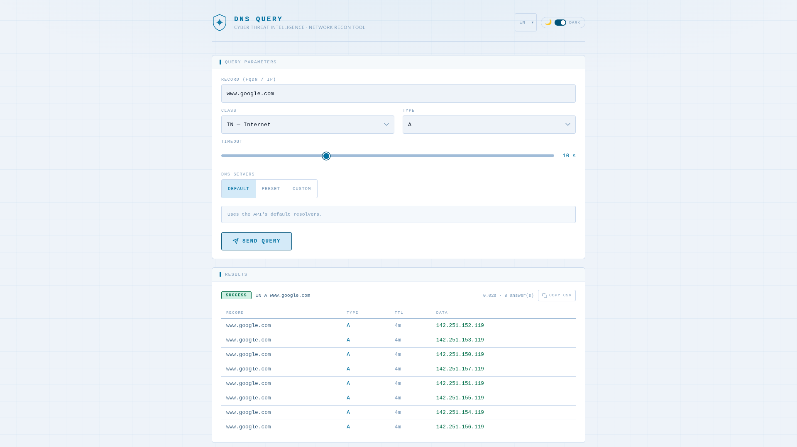

# http2dns

> **DNS-over-HTTP** — A lightweight, stateless HTTP gateway that exposes DNS queries as a JSON REST API.

Built in Go, it accepts a `POST` request with a DNS query description and returns the resolved records as structured JSON. The binary embeds a static web UI and an OpenAPI specification, with zero runtime dependencies.

---

## Screenshot



> The embedded web UI (served at `/`) provides an interactive form to issue DNS queries and inspect responses directly in the browser. It supports **dark and light themes** and is fully translated into **15 languages**.

---

## Disclaimer

This project is released **as-is**, for demonstration or reference purposes.
It is **not maintained**: no bug fixes, dependency updates, or new features are planned. Issues and pull requests will not be addressed.

---

## License

This project is licensed under the **MIT License** — see the [`LICENSE`](LICENSE) file for details.

```
MIT License — Copyright (c) 2026 jctools
```

---

## Features

- Single static binary — no external runtime dependencies
- Embedded web UI and OpenAPI 3.1 specification (`/openapi.json`)
- Web UI available in **dark and light mode**, switchable at runtime via a toggle
- Web UI fully translated into **15 languages**: Arabic, Bengali, Chinese, German, English, Spanish, French, Hindi, Indonesian, Japanese, Korean, Portuguese, Russian, Urdu, Vietnamese
- Supports **A, AAAA, CNAME, MX, NS, PTR, SOA, TXT, SRV, NAPTR, OPT, ANY** record types
- DNS classes: **IN, CH, HS, CS**
- Automatic **UDP → TCP fallback** for truncated responses (large TXT records, etc.)
- Configurable DNS servers per-request or via environment variable
- Configurable listen address and query timeout
- Docker image built on `scratch` — minimal attack surface

---

## Build

### Prerequisites

- [Go](https://go.dev/dl/) **1.24+**

### Native binary (Linux)

```bash
bash scripts/linux_build.sh
```

The binary is output to `./out/http2dns`.

The script produces a **fully static binary** (no libc dependency):

```bash
go build \
    -trimpath \
    -ldflags="-extldflags -static -s -w" \
    -tags netgo \
    -o ./out/http2dns ./cmd/http2dns
```

### Windows

```cmd
scripts\windows_build.cmd
```

### Docker image

```bash
bash scripts/docker_build.sh
```

This runs a two-stage Docker build:

1. **Builder** — `golang:1.24-alpine` compiles a static binary
2. **Runtime** — `scratch` image, containing only the binary

The resulting image is tagged `nettools/http2dns:latest`.

---

## Run

### Native (Linux)

```bash
bash scripts/linux_run.sh
```

This sets `LISTEN_ADDR=0.0.0.0:8080` and runs the binary.

### Windows

```cmd
scripts\windows_run.cmd
```

### Docker

```bash
bash scripts/docker_run.sh
```

Equivalent to:

```bash
docker run -it --rm -p 8080:8080 -e LISTEN_ADDR=0.0.0.0:8080 nettools/http2dns:latest
```

Once running, the service is available at [http://localhost:8080](http://localhost:8080).

---

## Configuration

Each setting can be provided as a CLI flag or an environment variable. The CLI flag always takes priority. Resolution order: **CLI flag → environment variable → default**.

| CLI flag        | Environment variable | Default                    | Description                                                                          |
|-----------------|----------------------|----------------------------|--------------------------------------------------------------------------------------|
| `--listen-addr` | `LISTEN_ADDR`        | `127.0.0.1:8080`           | Address and port the HTTP server listens on. A bare port (e.g. `8080`) is accepted. |
| `--dns-servers` | `DNS_SERVERS`        | `8.8.8.8:53,8.8.4.4:53`   | Comma-separated list of DNS servers used when none are provided in the request.      |

**Examples:**

```bash
# Using CLI flags
./out/http2dns --listen-addr 0.0.0.0:9090 --dns-servers 1.1.1.1:53,9.9.9.9:53

# Using environment variables
LISTEN_ADDR=0.0.0.0:9090 DNS_SERVERS=1.1.1.1:53,9.9.9.9:53 ./out/http2dns
```

---

## API Reference

### `POST /api/v1/dns`

Performs a DNS query and returns the resolved records.

#### Request body

```json
{
  "class": "IN",
  "type": "A",
  "record": "example.com",
  "dnsservers": ["8.8.8.8:53", "1.1.1.1:53"],
  "timeout": 5
}
```

| Field        | Type             | Required | Description                                                                                   |
|--------------|------------------|----------|-----------------------------------------------------------------------------------------------|
| `class`      | `string`         | ✅       | DNS class. One of: `IN`, `CH`, `HS`, `CS`                                                    |
| `type`       | `string`         | ✅       | Record type. One of: `A`, `AAAA`, `CNAME`, `MX`, `NS`, `PTR`, `SOA`, `TXT`, `SRV`, `NAPTR`, `OPT`, `ANY` |
| `record`     | `string`         | ✅       | DNS name to resolve (e.g. `example.com`)                                                      |
| `dnsservers` | `string[]`       | ❌       | List of DNS servers (`host:port`). Falls back to `DNS_SERVERS` env var, then Google DNS.      |
| `timeout`    | `integer`        | ❌       | Query timeout in seconds (default: `5`, range: `1–60`)                                        |

#### Response body

```json
{
  "status": "SUCCESS",
  "answers": [
    {
      "record": "example.com",
      "type": "A",
      "ttl": 3600,
      "data": "93.184.216.34"
    }
  ]
}
```

| Field     | Type       | Description                                         |
|-----------|------------|-----------------------------------------------------|
| `status`  | `string`   | `SUCCESS`, `NXDOMAIN`, `ERROR`, or `TMOUT`          |
| `answers` | `Answer[]` | List of DNS records. Empty when status ≠ `SUCCESS`. |

Each `Answer` object:

| Field    | Type      | Description                               |
|----------|-----------|-------------------------------------------|
| `record` | `string`  | Resolved DNS name                         |
| `type`   | `string`  | Record type                               |
| `ttl`    | `integer` | Time-to-live in seconds                   |
| `data`   | `string`  | Record value (IP, hostname, raw text, …)  |

#### Status codes

| Value      | Meaning                                          |
|------------|--------------------------------------------------|
| `SUCCESS`  | Query succeeded, `answers` is populated          |
| `NXDOMAIN` | Domain does not exist                            |
| `ERROR`    | Query failed (bad request or network error)      |
| `TMOUT`    | All DNS servers timed out                        |

#### Example — resolve an MX record

```bash
curl -s -X POST http://localhost:8080/api/v1/dns \
  -H "Content-Type: application/json" \
  -d '{"class":"IN","type":"MX","record":"gmail.com"}' | jq .
```

```json
{
  "status": "SUCCESS",
  "answers": [
    {
      "record": "gmail.com",
      "type": "MX",
      "ttl": 3600,
      "data": "5 gmail-smtp-in.l.google.com."
    }
  ]
}
```

### `GET /`

Returns the embedded interactive web UI.

### `GET /openapi.json`

Returns the full OpenAPI 3.1 specification of the API.

### `GET /favicon.png`

Returns the application icon.

---

## Development

Dependencies are managed with Go modules. After cloning:

```bash
go mod download
go build ./...
```

The test suite and initialization scripts are located in `scripts/`:

```
scripts/000_init.sh     # Environment setup
scripts/999_test.sh     # Integration tests
```

---

## AI-Assisted Development

This project was developed with the assistance of **[Claude Sonnet 4.6](https://www.anthropic.com/claude)** by Anthropic.
